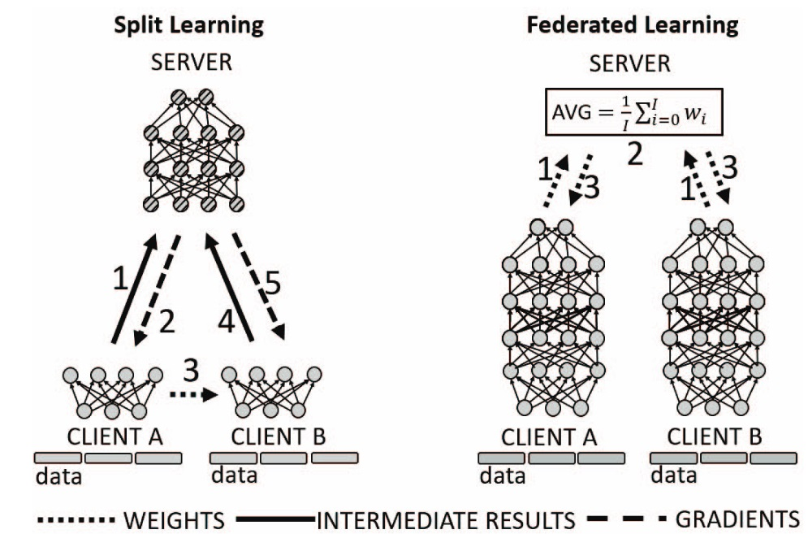

# Bloom - Federated vs. Split learning performance



Figure: Difference between split and federated learning architecture. <a href="https://par.nsf.gov/servlets/purl/10347871">Source</a>

## Table of Contents

1. [Code structure](#code_struct)
2. [Requirements](#req)
3. [Running the program](#run)

### Code structure <a name="code_struct"></a>
The project includes three main learning types: centralized, split and federated (averaging) learning.
For split and federated learning, a server-client architecture is launched, and training/testing data as well as parts of (split learning) or the entire model (federated learning) transmitted between them. In addition, helper classes and methods provide the following functionalities:

- read the project configurations
- load and/or distribute the datasets
- set up clients
- save and load snapshots of models
- evaluate the results

### Requirements <a name="req"></a>
Requirements can be found in ```pyproject.toml```. To find out how to install the necessary packages, including bloom, read ```CONTRIBUTING.md```.
(updated 10.10.2023)

### Running the program <a name="run"></a>
After following the instructions in ```CONTRIBUTING.md```, navigate to ```\centralized``` and follow the ```README.md``` instructions there.
(updated 10.10.2023)
